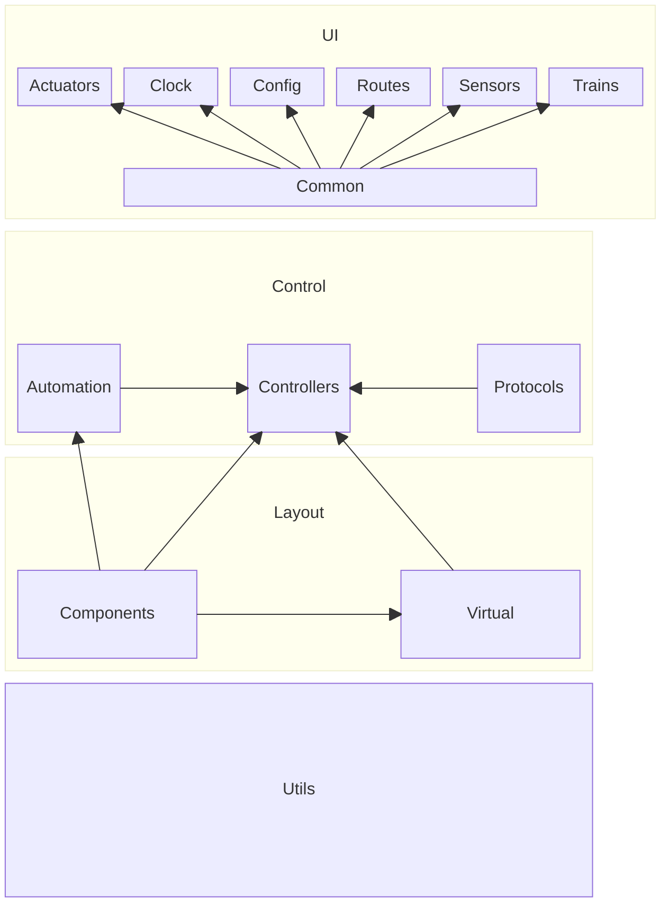

# HyraxRail

Hyrax Rail is a cross platform model train controller app, based on QT 6, using QWidgets. The main principles of it's design are as follows:

* Cross Platform : Rely on QT as much as possible to maintain portability
* Zero config : Pull as many settings from the controller as possible to make use plug and play
* Extendable : It should be possible to add new models of controller without changing the UI code

## Architecture

## Controller Support

* Märklin Central Station 1 (60212) : _In progress_
* Märklin Central Station 2 (60215) : _Planned_
* DCC-Ex : _planned_

## Operating System Support

* Windows : _Done_
* Mac OS : _Done_
* Android : _Done_
* Linux : _Planned_

## Getting Started

To get started, navigate to the _settings_ tab and select _Add Controller_.

Select the controller model from the drop-down. The default protocol and connection settings will automatically populate. If you wish to change them, do so here. Note that the COM port and IP address fields must always be manually entered. Press OK to continue.

The app will automatically populate the trains, actuators, routes and sensors configured on your controller. Any changes you make to this configuration will be pushed back to the controller.

## Contributors

### Localization Team

* [Long Dương](https://github.com/longd1999) : Vietnamese

### Other Credits

App icon by [Rose Spencer-Spreeuw](https://www.linkedin.com/in/rose-spencer-spreeuw-82278a1a1/).
