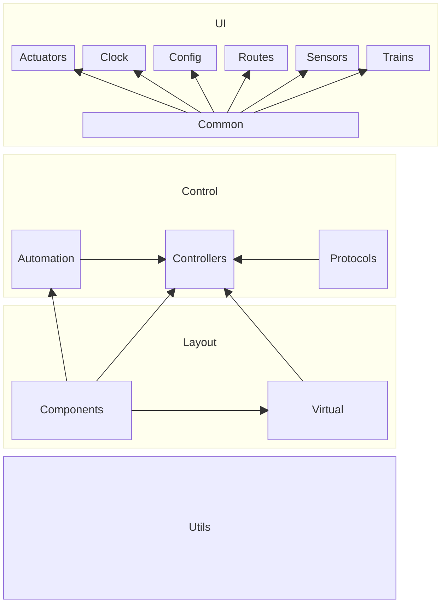

Landing page for the Hyrax Rail Obsidian. This serves as the design notes for the application.
## Architecture  

```mermaid

%%{ init : { "flowchart" : { "curve" : "stepAfter" }, 'block': { 'padding': 12 } }}%%

block

columns 1

block:UI

columns 6

  

UILabel["UI"]:6

style UILabel fill:transparent,stroke:none;

  

Actuators

Clock

Config

Routes

Sensors

Trains

  

space:6

  

space:1

Common:4

  

Common --> Actuators

Common --> Clock

Common --> Config

Common --> Routes

Common --> Sensors

Common --> Trains

end

  

block:Control

columns 5

  

space:2

ControlLabel["Control"]

style ControlLabel fill:transparent,stroke:none;

space:2

  

Automation

space

Controllers

space

Protocols

  

Automation --> Controllers

Protocols --> Controllers

end

  

block:Layout

columns 3

  

space:1

LayoutLabel["Layout"]

style LayoutLabel fill:transparent,stroke:none;

space:1

  

Components

space

Virtual

  

Components --> Virtual

end

  

Components --> Controllers

Components --> Automation

Virtual --> Controllers

  

Utils

```